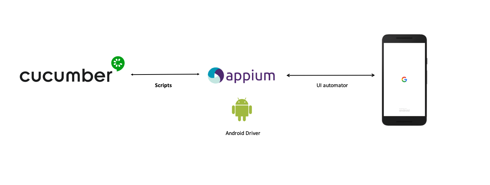

# Scenario testing

Scenarios contained in feature files written in Gherkin language. Available scenarios can be found [here](android-scenario-testing/src/test/resources/io/cucumber). 

Defined for the [ownCloud Android app](https://github.com/owncloud/android)


## Global architecture

- Scenarios are defined with [Gherkin Syntax](https://cucumber.io/docs/gherkin/).

- Steps are interpreted by [Cucumber](https://cucumber.io/). 

- Step implementation language: [Java](https://docs.oracle.com/javase/7/docs/)

- Device interaction with [Appium](http://appium.io/)



## Get the code

- With git: 

`git clone https://github.com/owncloud/android-scenario-testing.git`

- Download a [zip file](https://github.com/owncloud/android-scenario-testing/archive/master.zip)

## Requirements

Different requirements:

* `Appium` instance running and reachable

* Device attached. Check command `adb devices` to ensure `Appium` will get the device reference to interact with it

* A `local.properties` file should be included in the project with the following parameters:

  * Remote set up:

      * `serverURL`: Server URL with basic auth
      * `OAuth2URL`: Server URL with OAuth2
      * `userName1`: Username of existing user in all servers to test (to simplify)
      * `passw1`: Password for the users defined in `userName1`
      * `userToShare`: Existing user to search and share with
      * `userToSharePwd`: Password of `userToShare`
      * `hostName`: Name of the server host
      * `appiumURL`: URL of running Appium server

  * App parameters:

      * `apkName`: Name of the apk
      * `appPackage`: Package name of the app to test
      * `userAgent`: User Agent of the client

The environment variable `$ANDROID_HOME` needs to be correctly set up, pointing to the Android SDK folder

## How to test

The simplest way:

```
./gradlew test
```

executed in the root folder the project. This order runs Cucumber features using the proper runner `Cucumber`. The `@RunWith(Cucumber.class)` annotation on the `RunCucumberTest` class tells JUnit to kick off Cucumber.

But it is posible to add interesting options:

`--rerun-tasks` : avoid gradle's optimization

`--info` : suggested logging level. Other options: `--debug`, `--warn` , `--quiet`. In case no option is selected, default is `--warn`

So, recommended command to run all the tests:

```
./gradlew test --rerun-tasks --info 
```

the command will display step by step how the scenario is being executed.

## Test filtering

There are two ways to select specific features to test.

The main class `RunCucumberTest` contains the annotation `@CucumberOptions` in which different options are set. This is an static way to set up.

The `cucumber.options` annotation will allow to set options in the command line execution.

### By feature file

Let the option know where the feature file is stored and only the defined scenarios inside will be triggered. Any other will be ignored. For example:

```
./gradlew test --rerun-tasks --info -Dcucumber.options=\src⁩/test⁩/⁨resources⁩/⁨io⁩/⁨cucumber/login.feature⁩"
```
### By tag

With a tag just above the scenario definition, it is posible to select which scenarios will be tested:

```
  @oauth2
  Scenario: A valid login with OAuth2
    When server with OAuth2 is available
    And user logins as user1 with password a as OAuth2 credentials
    Then user can see the main page
```

Then...

````
./gradlew test --rerun-tasks --info -Dcucumber.options="--tags @oauth2"
````

will trigger only that tests and others with the same tag

More than one tag is allowed (separated with `,`)

````
./gradlew test --rerun-tasks --info -Dcucumber.options="--tags @oauth2,@basic,@sharing"
````

More info in [Cucumber reference](https://cucumber.io/docs/cucumber/api/)

**Note**: This repository was forked from [Cucumber-java skeleton](https://github.com/cucumber/cucumber-java-skeleton) repository, which contaions the base skeleton to start working.